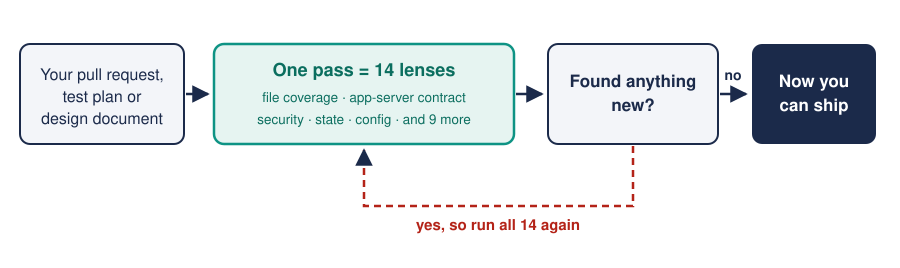
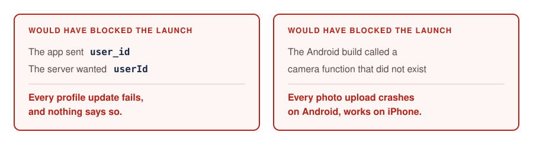

<div align="center">

# 🔍 Deep Review: a 14-lens review loop for Claude Code

### I review my own work fourteen times before I ship it, because one pass keeps missing things.

     

</div>

---

Claude Code is Anthropic's AI assistant for writing software, and this is one file you hand it. It
reviews your work through fourteen different lenses, then keeps going until a whole pass finds nothing
new.

The first time I ran it on a release it found **14 production bugs across 28 rounds**. Two would have
broken every server call and every image upload on day one, and the review before had found neither.



## Why I run fourteen passes and not one

I was about to ship a release that had been reviewed once. Something felt off, so I reviewed it again
from a different angle and found a serious bug. I tried a third angle and found another. By the time I
stopped I had fourteen angles and fourteen bugs a normal review had walked straight past.

Each angle catches a different *category* of problem, so I wrote the angles down as a skill so I'd
never ship without running them, and this repo is that skill.

<details>
<summary><b>📋 The fourteen lenses, in the order they run</b></summary>

<br>

A *lens* is one pass with one question in mind.

1. **File completeness:** does the work cover every file it claims to?
2. **Function-level audit:** inside the files it does cover, is every piece of code actually addressed?
3. **Category gaps:** is a whole category missing, like no end-to-end tests anywhere?
4. **Cleanup and performance:** timers and listeners left running, memory quietly leaking, slow code on
   a path that runs constantly.
5. **Client-server contract:** does the app agree with the server about what it's sending? The worst
   bugs live here.
6. **Platform-specific paths:** if the code does one thing on Android and another on iPhone, are both
   branches covered?
7. **Network and error conditions:** what happens with no signal, a timeout, or a server refusing to
   answer.
8. **State transitions:** every state the app can be in, and every way in and out of it.
9. **UX details:** the back button inside a popup, blank screens, images that fail to load.
10. **Infrastructure and config:** every settings file, read end to end.
11. **Security and secrets:** passwords and keys, which other sites are allowed to call your server
    (CORS) and with what headers, and anything a user types that reaches the database unchecked.
12. **Data rules:** every table, and every thing nested inside it, which is the one people forget.
13. **Quality of what's already there:** tests that pass while testing the wrong thing.
14. **Internal consistency:** does the document contradict itself?

Full descriptions live in [SKILL.md](SKILL.md).

</details>

## Installing it takes three lines

```bash
git clone https://github.com/aksheyw/claude-code-deep-review.git && cd claude-code-deep-review
cp SKILL.md ~/.claude/skills/deep-review.md          # the skill itself
cp rule.md  ~/.claude/rules/deep-review.md           # optional: lets it trigger on its own
```

Then ask for it in any session:

```
Use the deep-review skill on this pull request
```

With the optional rule installed it also picks itself up when you ask the obvious things, like *did you
miss anything?*, *is this thorough?*, or *check again*.

<details>
<summary><b>🔧 If you're new to Claude Code, or the install didn't take</b></summary>

<br>

Claude Code runs in your terminal, reads the files in your project, and can change them for you. You
teach it new behaviour by dropping in a *skill*, which is just a markdown file of instructions it loads
when a matching task comes up. `~/.claude/` is the folder it keeps its own settings in, so copying a
file there is how you hand it something new. This repo is one skill.

**Check it worked.** Open a new session and try any of these:

- Type `/deep-review`. It should offer to complete it for you.
- Ask *"use the deep-review skill on this pull request"*. It should pick it up by name.
- If you installed the optional rule, *"is this thorough?"* should set it off by itself.

**If it didn't:**

- **`/deep-review` doesn't complete when I type it:** check the file actually landed at
  `~/.claude/skills/deep-review.md`. A folder layout (`~/.claude/skills/deep-review/SKILL.md`) works
  too, but use one or the other, not both.
- **It never triggers on its own:** install the optional `rule.md` to `~/.claude/rules/deep-review.md`.
  That's what makes it listen for review-ish phrasing.
- **The rule doesn't seem to load:** some versions of Claude Code don't pick up `~/.claude/rules/`
  automatically. Paste the rule's contents into your project's `CLAUDE.md` file instead, which is the
  per-project instructions file Claude Code always reads.
- **It runs one or two rounds and stops:** it's cutting the job short. Add *"keep going until a full
  round produces zero new findings"* to your request, because that's the actual stopping condition.

</details>

## The two that would have shipped were both boring



The app was sending a field called `user_id` while the server was looking for `userId`. Same word to a
human, different word to a machine, so every attempt to update a profile would have failed silently.
And the Android version was calling a function that didn't exist in the layer connecting the app to the
phone's camera, so every image upload would have crashed on Android and worked fine on iPhone.

Neither one is exotic, and both of them had already been through a review.

<details>
<summary><b>📄 What a run actually looks like</b></summary>

<br>

An illustration of the cadence, shortened. The longer one is in
[examples/sample-output.md](examples/sample-output.md).

```
## Round 1: File Completeness
Findings: 3 new
- Missing test plan entry for `src/api/auth.ts` — Severity: HIGH
- New file `src/lib/imageUpload.ts` not mentioned anywhere — Severity: HIGH
- `src/components/EmptyState.tsx` has no test coverage section — Severity: MEDIUM
Running total: 3 findings, 0 ship-stoppers.

## Round 5: Client-Server Contract Alignment
Findings: 2 new
- 🚨 CRITICAL — Client sends `{ user_id }`, server expects `{ userId }` —
  every API call to `/profile/update` will silently 400 — SHIP-STOPPER
- Auth header missing on `/upload` endpoint client-side — Severity: HIGH
Running total: 8 findings, 1 ship-stopper.

## Round 6: Platform-Specific Paths
Findings: 1 new
- 🚨 CRITICAL — Android image-upload branch calls a method that does not
  exist on the Capacitor bridge — SHIP-STOPPER
Running total: 9 findings, 2 ship-stoppers.

## Deep Review Complete
Stopped at the first clean pass of all 14 lenses · Total findings: 14 · Ship-stoppers: 2 (both fixed)
```

Each round is one lens, every finding carries a severity, and the loop ends when a full pass of all
fourteen finds nothing new. *Ship-stopper* is my word for a bug bad enough that you don't release until
it's fixed.

</details>

## I run it at boundaries, not on typos

Run it before merging anything that crosses a boundary, where your app talks to a server, a database or
a login system, because that is where the expensive bugs hide. It's also worth it on a test plan, an
architecture document or a security review, to check that a whole category didn't get skipped.

Skip it on small obvious changes, because it's overkill and you'll resent it. Same for rough
exploration you already plan to redo, and for anything still being designed, where the work is meant to
be incomplete.

<details>
<summary><b>⏳ How long a run takes, and what each file in this repo does</b></summary>

<br>

| Scope | Rounds |
|-------|--------|
| Small: one file, a short document | 5-8 |
| Medium: several files, a full plan | 10-15 |
| Large: a whole codebase, or a launch readiness check | 15-20+ |

Each round is one lens. It stops when a full pass produces nothing new.

| File | What it's for |
|------|---------|
| `SKILL.md` | The skill itself. This is the file that does the work. |
| `rule.md` | Optional. A short instruction that makes the assistant reach for the skill on its own when you ask review-ish questions. |
| `examples/sample-output.md` | An illustration of a run, round by round, start to finish. |
| `LICENSE` | MIT, so you're free to use it in your own work. |

</details>

<details>
<summary><b>📦 The other four Claude Code toolkits I keep in the open</b></summary>

<br>

- [`claude-code-pm-agents`](https://github.com/aksheyw/claude-code-pm-agents): 7 specialist assistants
  for product work, covering PM docs, growth, brand, ASO (app-store listings), SEO, YouTube, and inbox
  triage.
- [`claude-code-rules`](https://github.com/aksheyw/claude-code-rules): the standing instructions I load
  into every session, including the one that reaches for this skill automatically.
- [`claude-code-learned-skills`](https://github.com/aksheyw/claude-code-learned-skills): 12 skills
  pulled out of real debugging and research sessions, covering Docker, SSH and VPS (rented server)
  work, ML pipelines, prompting guides, quality tooling, and a project wiki.
- [`career-command-center-template`](https://github.com/aksheyw/career-command-center-template): a full
  job-search setup you can copy and fill in with your own details, with 12 skills, 8 blank templates
  for your own data, and the automation to run it.

</details>

---

MIT licensed, so you're free to use it in your own work. Built by
[Akshey Walia](https://github.com/aksheyw). If you use this and hit a bug the lenses missed, open an
issue. The list is meant to grow.
